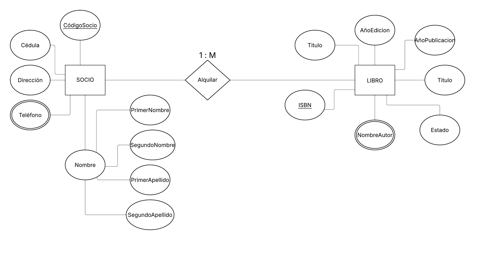
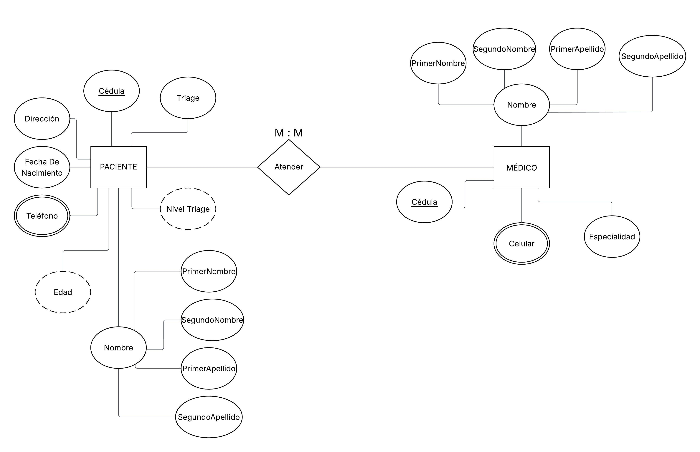

# Modelado Entidad-Relación

## Ejercicio "Biblioteca"

- Las personas socias de la biblioteca disponen de un código de socio y además necesitar almacenar su cédula, dirección, teléfono, nombre y apellidos.
- La biblioteca almacena libros que presta a los socios, de ellos se almacena su título, año en el que se escribió el libro, nombre completo del autor (o autores), año en que se editó, en qué editorial fue y el ISBN.
- Necesitamos poder indicar si un libro en la biblioteca está dañado o no.

### Solución

## Ejercicio "Hospital"

- Los pacientes tienen una cédula, dirección, teléfonos de contacto, nombre y apellidos, fecha de nacimiento y edad.
- Los médicos del Hospital también tienen su cédula, nombre completo, especialidad y celular.
- Necesitamos poder indicar si un paciente ya pasó por Triage (en una fecha) y saber cual es su nivel de esa evaluación.

### Solución

