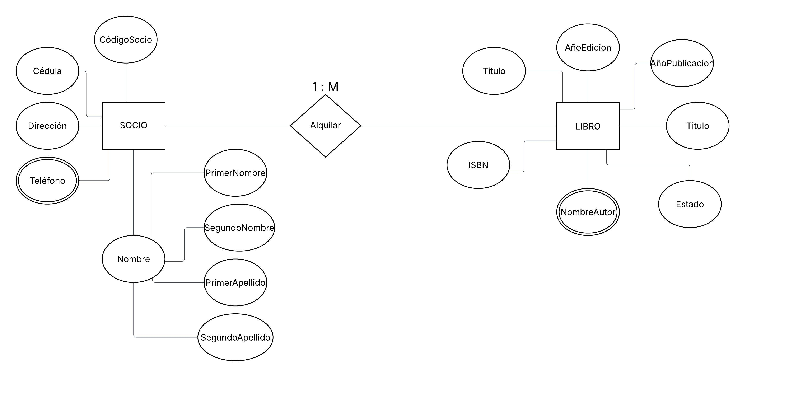
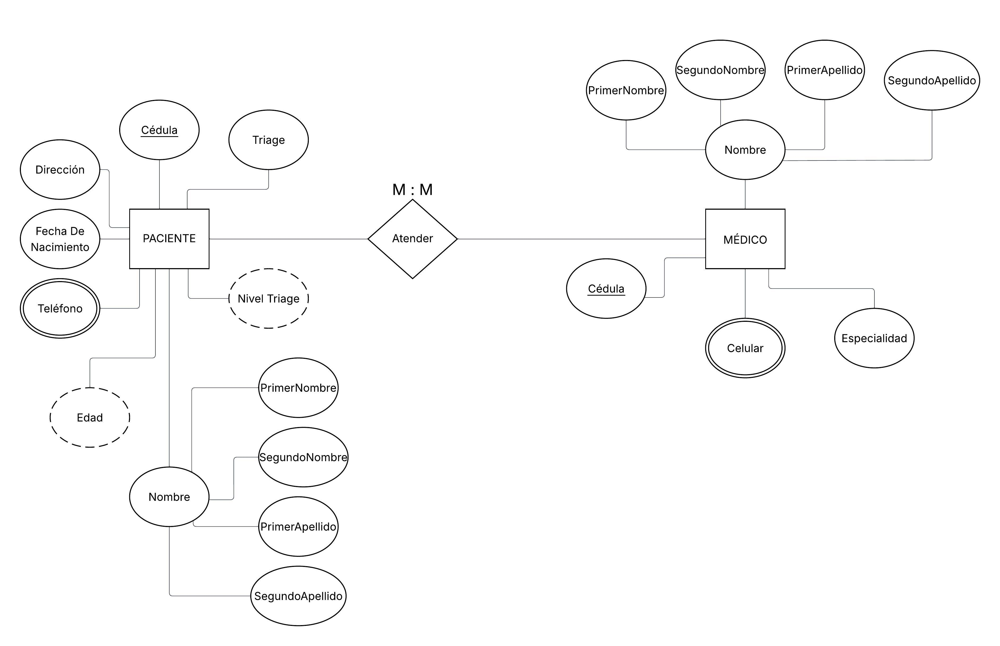
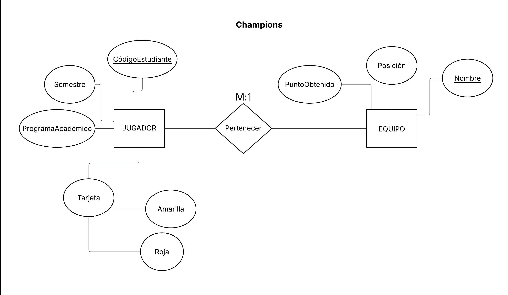

En caso de no poder visualizar con claridad los modelos ¡puedes hacer click en las imágenes para verlas en una nueva pestaña!

# Primeros ejercicios

- [Biblioteca](#ejercicio-biblioteca)
- [Hospital](#ejercicio-hospital)
- [University Champions league](#ejercicio-university-champions-league)

# Taller Modelo Entidad Relación 1

- [Ejercicio 1](#ejercicio-1)
- [Ejercicio 2](#ejercicio-2)
- [Ejercicio 3](#ejercicio-3)
- [Ejercicio 4](#ejercicio-4)
- [Ejercicio 5](#ejercicio-5)
- [Ejercicio 6](#ejercicio-6)
- [Ejercicio 7](#ejercicio-7)

# Taller Modelo Entidad Relación 3

- [Ejercicio 1](#ejercicio-1-1)
- [Ejercicio 2](#ejercicio-2-1)
- [Ejercicio 3](#ejercicio-3-1)
- [Ejercicio 4](#ejercicio-4-1)

# Primer Taller Grupal

- [Ejercicio Nómina](#ejercicio-nómina)
- [Ejercicio Residuos Tóxicos](#ejercicio-residuos-tóxicos)
- [Ejercicio Eat'n Go](#ejercicio-eatn-go)

## Primeros ejercicios

## Ejercicio "Biblioteca"

- Las personas socias de la biblioteca disponen de un código de socio y además necesitar almacenar su cédula, dirección, teléfono, nombre y apellidos.
- La biblioteca almacena libros que presta a los socios, de ellos se almacena su título, año en el que se escribió el libro, nombre completo del autor (o autores), año en que se editó, en qué editorial fue y el ISBN.
- Necesitamos poder indicar si un libro en la biblioteca está dañado o no.

### Solución

<!--  -->

  

## Ejercicio "Hospital"

- Los pacientes tienen una cédula, dirección, teléfonos de contacto, nombre y apellidos, fecha de nacimiento y edad.
- Los médicos del Hospital también tienen su cédula, nombre completo, especialidad y celular.
- Necesitamos poder indicar si un paciente ya pasó por Triage (en una fecha) y saber cual es su nivel de esa evaluación.

### Solución

<!--

-->

  

## Ejercicio "University Champions League"

El equipo organizador de la University Champions League de la Universidad El Bosque, requiere un
sistema de información que almacene las estadísticas del torneo de fútbol que se llevará a cabo en el mes de
Abril. Por consiguiente, la información que se requiere consultar está relacionada a los equipos de fútbol, los
semestres, los programas académicos al que pertenece, información de cada jugador, puntos obtenidos en cada
juego, tarjetas amarillas/rojas por cada jugador y las posiciones de la tabla en tiempo real.

### Solución

<!--

-->

  

## Taller Modelo Entidad Relación 1

## Ejercicio 1

Se desea informatizar la gestión de una empresa de transportes que reparte paquetes por toda Colombia. Los encargados de llevar los paquetes son los Conductores, de los que se quiere guardar el número de cédula de ciudadanía, nombre, teléfono, dirección, salario y ciudad en la que vive. De los paquetes transportados interesa conocer el código de paquete, descripción, destinatario y dirección del destinatario. Un conductor distribuye muchos paquetes, y un paquete sólo puede ser distribuido por un conductor. De las ciudades a las que llegan los paquetes interesa guardar el código de ciudad y el nombre. Un paquete sólo puede llegar a una ciudad. Sin embargo, a una ciudad pueden llegar varios paquetes. De los camiones que llevan los Conductores, interesa conocer la matrícula, modelo, tipo y potencia. Un conductor puede conducir diferentes camiones en fechas diferentes, y un camión puede ser conducido por varios Conductores.
Constrúyase un diagrama E-R. Indique cuáles son las entidades identificadas con los atributos, llaves primarias y llaves foráneas de cada una. Realice la reducción a tablas respectiva y documente todas las decisiones que se hagan acerca de restricciones de correspondencia.

### Solución

  

## Ejercicio 2

Una empresa de bienes raíces realiza un seguimiento de las casas en venta y de los clientes que buscan comprar casas. Una casa en venta puede estar listada con esta firma o con otra diferente. Estar “listado” con una firma significa que el dueño de la casa tiene un contrato con un agente que trabaja para esa firma. Un agente de bienes raíces de la empresa se caracteriza por tener un nombre (compuesto por Primer nombre, Segundo Nombre, Primer Apellido y Segundo Apellido), cédula de ciudadanía, género, fecha de nacimiento (sobre la cual se obtiene la edad), una cantidad de ventas realizadas en el último mes y un código de agente único. Cada casa en el mercado tiene precio, dirección, propietario y una lista de características, como el número de dormitorios, baños, tipo de calefacción, electrodomésticos, tamaño del garaje, etc. Esta lista puede ser diferente para diferentes casas, y algunas características pueden estar presentes en algunas casas, pero faltar en otras. Asimismo, cada cliente tiene preferencias que se expresan en los mismos términos (el número de dormitorios, baños, etc.). Aparte de estas preferencias, los clientes especifican el rango de precios de las casas que les interesan.

### Solución

  

## Ejercicio 3

Considere el siguiente esquema de base de datos (estructura de tablas y relaciones):
•
Proveedor (SName, ItemName, Price): el proveedor SName vende el artículo ItemName al precio Price

•
Cliente (CName, Address): el CName del cliente vive en Address.

•
Pedido (CName, SName, ItemName, Qty): el cliente CName ha pedido la cantidad del artículo ItemName al proveedor SName.

•
Elemento (ItemName, Description): información sobre los elementos.

Dibuje el diagrama E-R del que podría haberse derivado el esquema anterior

### Solución

  

## Ejercicio 4

Realizar el diseño conceptual (mediante un diagrama E-R) de las operaciones de una biblioteca comunitaria local. La biblioteca tiene libros, CD, cintas, etc., que se prestan a diferentes usuarios. Estos últimos cuentan con un número de cuenta único, direcciones, números telefónicos, fecha de nacimiento, entre otros. Si un artículo prestado está vencido (por fuera de la fecha límite de entrega), acumula penalización. Algunos usuarios son menores de edad (menores a 18 años), por lo que deben tener patrocinadores que sean responsables de pagar las multas (o reemplazar un libro en caso de pérdida).

### Solución

  

## Ejercicio 5

Una cadena de supermercados está interesada en construir un sistema de apoyo a la decisión con el que pueda analizar las ventas de diferentes productos en diferentes supermercados en diferentes momentos. Cada supermercado está ubicado en área geográfica: una ciudad, que está en un estado, que está en una región. El tiempo en el que realizó una o más ventas se puede medir en días, meses y años. Los productos tienen nombres y categorías (productos, productos enlatados, etc.).

### Solución

  

## Ejercicio 6

Considere el siguiente diagrama E-R:

  

### Solución

Es una empresa de prestamo de sucursales, identificadas principalmente por el nombre de la sucrusal, pero también se tiene la información de la ciudad de la misma y de si esta se encuentra activa. Los clientes se distinguen en el sistema principalmente por su id y a su vez, se registra su nombre, ciudad y calle; a estos se les concede un prestamo, identificado por su número único, y registrando su valor de importación. Estos clientes son previamente aconsejados por un empleado, identificado en sistema principalmente por su id, más también se registra su nombre, números de teléfono, el nombre de su o sus subordinados (En caso de que su rol sea de jefe), su fecha de ingreso y la antigüedad del mismo, adicionalmente, este puede ser un banquero o consejero, y le responde a un jefe.
Al momento de realizar un prestamo, se debe realizar un pago, reconocido en sistema principalmente por su número de pago, se toma la fecha de pago y el importe pagado. No obstante, a los clientes se les impone, con fecha de acceso, una cuenta, establecida por su número de cuenta, junto con su saldo su saldo y el tipo de cuenta, donde si es una cuenta de ahorros, se registra su tipo de interés, en caso de ser cuenta corriente, se registra su descubrimiento.

## Ejercicio 7

Una oficina de registro de una universidad mantiene datos acerca de las siguientes entidades: (a) asignaturas, incluyendo el número, título, programa, y prerrequisitos; (b) ofertas de asignaturas, incluyendo número de asignatura, año, semestre, número de sección,
profesor(es), horarios y aulas; (c) estudiantes, incluyendo id-estudiante, nombre y programa; y (d) profesores, incluyendo número de identificación, nombre, departamento y título. Además, la matrícula de los estudiantes en asignaturas y las notas concedidas a estudiantes en cada asignatura en la que están matriculados se deben modelar adecuadamente. Constrúyase un diagrama E-R para la oficina de registro.

### Solución

  

## Taller Modelo Entidad Relación 3

## Ejercicio 1

En el estacionamiento de la Universidad El Bosque se piensa implementar un espacio para la reparación de vehículos de los estudiantes, profesores y visitantes al centro médico Los Cobos. La idea es implementar una solución tecnológica y ustedes como Ingenieros de datos han sido seleccionados para diseñar el modelo de datos de una base de datos relacional, la cual maneja la información de sus clientes, los automóviles que atiende, los técnicos especializados que trabajan en el taller y los componentes que se usan en cada servicio.
El proceso de servicio es el siguiente:

1.  Al llegar al taller, se registran los datos del propietario y de su vehículo. Del propietario se guardan el número de identificación (NI), su nombre completo, dirección postal y número de teléfono. Del automóvil se registran la placa, la marca y el color. También se toma nota de la fecha y hora de ingreso del vehículo al taller.
2.  Tras el registro, se le asigna un técnico principal (que esté disponible) para que realice un diagnóstico de los daños.
3.  Posteriormente, este técnico puede solicitar el apoyo de otros especialistas para que lo asistan en la reparación.
4.  Los técnicos que participan en la reparación registran en una orden de trabajo los componentes que necesitaron, junto con el costo de la mano de obra.
5.  Una vez finalizado el servicio, la orden de trabajo se entrega al área de administración para que se genere la factura. La factura debe incluir toda la información del cliente, los datos del técnico asignado, un desglose de los componentes utilizados (con su precio unitario), el costo de la mano de obra y el total a pagar. Al total se le aplicará un impuesto del 21 %. Además, el precio total del servicio se mostrará en dos monedas distintas: dólares estadounidenses (USD) y euros (EUR).
6.  Todos los componentes tienen un código, nombre y precio, pero se diferencian en varias categorías:
    Aceites: Adicionalmente, registran la densidad.
    Filtros: Adicionalmente, registran el tipo de filtro (aire, aceite, combustible).
    Baterías: Adicionalmente, registran el amperaje y el voltaje.
    Neumáticos: Adicionalmente, registran el ancho, perfil y diámetro.

### Solución

  

## Ejercicio 2

Una empresa de servicios tecnológicos, "Soluciones Innova", ha decidido modernizar su sistema de gestión interno debido a que su plataforma anterior era ineficiente y no permitía registrar toda la información crucial para la toma de decisiones. Por ello, se ha encargado el desarrollo de un nuevo sistema de información con las siguientes especificaciones:

•
Se requiere almacenar la información de los clientes corporativos de la consultora. Por cada cliente, se necesita registrar su nombre de empresa, dirección, número de identificación tributaria (NIT), y es posible que tengan múltiples números de teléfono de contacto.

•
En la empresa se gestionan numerosos servicios que pueden ser contratados por uno o varios clientes a un precio que el gerente de proyecto define para cada contrato en particular.
•
Gracias a la buena reputación de la empresa, los clientes suelen contratar múltiples servicios. Se desea registrar estos contratos, así como las fechas de inicio y finalización planificadas para cada uno.

•
Independientemente del precio de venta, cada servicio tiene un costo interno asociado.

•
Todos los servicios generalmente tienen una descripción que detalla sus objetivos principales.

•
Los gerentes de proyecto se identifican por un código de empleado, y su remuneración se basa en un salario fijo que puede diferir del sueldo recomendado para su rango profesional. Además del salario y el sueldo recomendado, se necesita registrar el nombre del gerente.

•
Cada gerente de proyecto puede tener un superior directo de un rango profesional inmediatamente más alto.

Un punto crucial para la gestión de la empresa es el concepto de "equipo de proyecto". Cada equipo está formado por varios gerentes de proyecto que, a pesar de participar en un servicio, mantienen su independencia y pueden ser parte de otros equipos en paralelo. Sin embargo, para fines de planificación y facturación, el sistema debe reconocer que un equipo está compuesto por los gerentes que lo integran. Si un servicio se cancela, el equipo asociado deja de existir como tal, pero los gerentes que lo formaban continúan existiendo en la base de datos.

### Solución

  

## Ejercicio 3

Se requiere diseñar la base de datos para la gestión operativa del Sistema de Metro de Bogotá, asumiendo que ya cuenta con varias líneas en pleno funcionamiento. Los requisitos del sistema son los siguientes:

•
Estructura de Líneas: Una línea de metro se compone de una serie de estaciones en un orden secuencial, y es crucial registrar esta secuencia para la operación.

•
Conectividad de Estaciones: Cada estación del sistema pertenece a al menos una línea. Las estaciones de transferencia (como la futura Calle 72 o el Portal de las Américas) pueden pertenecer a varias líneas. Es importante destacar que una vez que una estación es asignada a una línea, esta pertenencia es permanente y no puede ser modificada.

•
Gestión de Accesos: Cada estación puede tener múltiples accesos para los usuarios (escaleras, ascensores, etc.). Un acceso está vinculado de manera exclusiva a una única estación, y esta asignación es inmutable.

•
Flota de Trenes: Cada línea tiene asignada su propia flota de trenes. Un tren puede estar asignado a una sola línea a la vez, aunque en ciertos momentos puede estar en mantenimiento y no pertenecer a ninguna. La cantidad de trenes asignados a cada línea debe ser, como mínimo, igual al número de estaciones de esa línea y, como máximo, el doble de dicho número.

•
Patio de Mantenimiento: El sistema tiene varios patios de mantenimiento y talleres. Cada tren debe tener un patio asignado para su resguardo. Un tren puede ser reasignado a un patio diferente, pero bajo ninguna circunstancia puede quedar sin uno.

•
Necesidades de Información: La gestión del sistema requiere poder consultar todos los accesos disponibles para los pasajeros en cada una de las líneas del metro.

### Solución

  

## Ejercicio 4

"La Facultad", una taberna icónica frente a la Universidad El Bosque, es conocida por su vasta colección musical. Su dueño, "Don Juan", un apasionado melómano, desea organizar su catálogo. Para ello, necesita una base de datos que gestione toda su discoteca.

La base de datos debe almacenar información sobre las grabaciones, los artistas que participan y las productoras que las distribuyen, con los siguientes requisitos:

•
Grabaciones Musicales: Se debe registrar el título, el género musical (p. ej., rock, jazz, salsa), la cantidad de canciones que contiene y un campo de notas para detalles especiales (como si es una edición limitada o en vivo). Cada grabación se identifica de manera única por su título.

•
Formatos: Cada grabación puede existir en diferentes formatos (por ejemplo, CD, vinilo o digital). Para cada formato, se debe registrar el estado de conservación (excelente, bueno, regular, etc.). Una misma grabación puede estar en varios formatos y cada uno tendrá un estado de conservación distinto.

•
Artistas: Es necesario registrar el nombre del artista y una breve biografía con sus logros más importantes. También se debe registrar en qué grabaciones ha participado cada artista y la fecha de dicha participación.

•
Productoras: Toda grabación está asociada a una productora. Se debe registrar el nombre y la dirección de la productora. Cada una se identifica de forma única con un ID de compañía.

### Solución

  

# Primer Taller Grupal

# Ejercicio Nómina

En base al siguiente esquema, crear un modelo E-R:

  

### Solución

## Modelo Entidad Relación Extendido con notación Peter – Chen

  

## Modelo Entidad Relación con notación Peter – Chen

  

## Modelo Entidad Relación con notación Barker

  

## Modelo Relacional con notación Barker

  

# Ejercicio Residuos Tóxicos

Se desea abordar la problemática ambiental de los residuos tóxicos y peligrosos cuya incorrecta gestión produce daños de gran importancia en el medio ambiente y en la salud del ser humano. La información a contemplar es la que corresponde desde que es producido el residuo por un centro o empresa productora hasta que éste se encuentra en lugar seguro, en donde recibe un tratamiento especial como puede ser la incineración, almacenamiento en depósitos de seguridad, etc. En el sistema de información se desea considerar la información de los productores de residuos, los residuos, las empresas que transportan los residuos hasta los lugares seguros y el traslado de los residuos teniendo en cuenta el tipo de transporte, el envase, etc.Es conveniente tener en cuenta los siguientes supuestos semánticos:

SUPUESTO 1: Una empresa productora produce un número amplio de residuos constituidos por un número variable de constituyentes químicos.

SUPUESTO 2: Más de una empresa productora puede producir residuos con igual número de constituyentes químicos y con las mismas o distintas cantidades.

SUPUESTO 3: Las empresas productoras asignan un código único a los residuos que producen, lo que les permite diferenciar distintas producciones de los mismos productos. Además, más de una empresa puede asignar el mismo código a los residuos que produce.

SUPUESTO 4: Los residuos pueden ser trasladados en su totalidad (cantidad total del mismo) o en partes, o no ser trasladados nunca.

SUPUESTO 5: En cada traslado de residuos la cantidad que se traslada de los mismos es enviada a un único destino.

SUPUESTO 6: En una misma fecha las empresas productoras pueden ordenar más de un traslado de un mismo o distinto residuo (cantidades parciales del mismo) a un mismo o distinto destino.

SUPUESTO 7: En cada traslado puede intervenir más de una empresa transportista usando el mismo o distinto transporte, por lo que resulta interesante conocer tanto el medio de transporte utilizado como los kilómetros realizados, así como el coste del trabajo.

SUPUESTO 8: El residuo se traslada en un tipo de envase determinado por la empresa productora y que no varía a lo largo de su traslado.

SUPUESTO 9: Es interesante conocer la fecha de llegada a destino y el tratamiento a que se someten los residuos una vez alcanzado el mismo.SUPUESTO 10: Por seguridad se considera que en un traslado sólo puede trasladarse un residuo de una empresa productora.

### Solución

## Modelo Entidad Relación Extendido con notación Peter – Chen

  

## Modelo Entidad Relación con notación Peter – Chen

  

## Modelo Entidad Relación con notación Barker

  

## Modelo Relacional con notación Barker

  

# Ejercicio Eat'n Go

Eat'n Go, una empresa internacional dedicada a la comercialización de comidas rápidas, tiene la intención de ubicar una franquicia en nuestra localidad, siéndole necesario informatizar la gestión del negocio adaptándolo a las características propias de la clientela esperada. Esta empresa se dedica a la venta de pizzas y bocadillos, además de productos complementarios como refrescos, helados, etc.Según las especificaciones aportadas por esta empresa se sabe que:

SUPUESTO 1: Tanto las pizzas como los bocadillos pueden condimentarse con un número de ingredientes de entre un conjunto de ellos con los que trabaja la empresa.

SUPUESTO 2: Los ingredientes con los que se hacen los bocadillos pueden ser iguales o distintos a aquellos con los que se hacen las pizzas.

SUPUESTO 3: El número de ingredientes que intervienen en un artículo que se vende (pizza o bocadillo) no está delimitado, pudiendo realizarse una venta de estos artículos sin ningún ingrediente. Es decir, la empresa vende también las bases de las pizzas y el pan con los que prepara las pizzas y los bocadillos, respectivamente.

SUPUESTO 4: Cada artículo que vende la empresa (pizzas, bocadillos y productos complementarios) tiene un precio base asignado (el precio de estos productos cuando se venden de forma independiente), sin contar los ingredientes que pueden acompañar a alguno de estos tipos de artículos.

SUPUESTO 5: Cada ingrediente tiene un precio para los bocadillos, mientras que para las pizzas todos los ingredientes tienen el mismo precio (los productos complementarios no llevan ingredientes).

SUPUESTO 6: Los artículos se pueden vender en distinto tamaño, en cuyo caso el precio base es distinto según el tamaño, y el precio de los ingredientes también. Existen, actualmente, tres tamaños en los que se venden los bocadillos y las pizzas (pequeño, normal y grande).

SUPUESTO 7: Las ventas se pueden hacer de tres formas diferentes: para consumir en el local, para recoger en el local y llevar o consumir en el mismo, y para servir a domicilio, en cuyo caso puede incrementarse un cargo añadido por el porte de la venta.

SUPUESTO 8: Los artículos complementarios que vende la empresa tienen un precio fijo en base a su tipo, tamaño, sabor, etc.

SUPUESTO 9: Los clientes pueden solicitar un servicio de la empresa (un pedido) tanto personalmente en el local como telefónicamente.

SUPUESTO 10: En los pedidos telefónicos se tomarán los datos completos del cliente; en los de recoger sólo el documento nacional de identidad y su nombre completo, y en los de consumir en el local no se tomará ningún dato, a no ser que sea necesario por otras razones.

SUPUESTO 11: A la empresa le interesa mantener información de todos los clientes a los que se les recoge información por dos razones:Simplemente a escala informativa, de consumo y marketing.Para llevar el control del consumo y favorecer, mediante obsequios, a aquellos clientes que alcancen un cierto consumo.

SUPUESTO 12: La empresa organiza, a veces, promociones para sus clientes. Éstas se basan en el obsequio de algún regalo o artículo de propaganda sobre la base de:Las unidades consumidas de alguno de los tipos de artículos: pizzas o bocadillos.Cargo total alcanzado en los pedidos.

SUPUESTO 13: Cuando la empresa obsequia a los clientes con algún artículo de promoción siempre recaba de los mismos toda su información y, además mantiene información sobre los regalos de promoción que se les entrega para, a ser posible, no hacer entregas duplicadas de los mismos.

SUPUESTO 14: La empresa cuenta con una serie de repartidores encargados del reparto a domicilio y de una batería de scooters para ayudarles en su cometido. Cada reparto se le asigna a un repartidor, el cual tiene asignado un scooter, aunque un mismo scooter puede ser utilizado por distintos repartidores (por supuesto en distintos turnos de trabajo).

SUPUESTO 15: A la empresa le interesa conocer información del coste de los scooters sobre la base del consumo de gasolina de los mismos en la realización de los repartos.

SUPUESTO 16: Los precios de todos los artículos que vende la empresa tienen el IVA incluido.

SUPUESTO 17: En los pedidos a domicilio existe un mínimo, en lo referente al valor del pedido, para que éste sea servido. Si el valor de los artículos que componen el pedido no alcanza este mínimo y el cliente desea que se le sirva a domicilio, se le cobrará ese mínimo.

SUPUESTO 18: La empresa cuenta con una serie de pizzas y bocadillos "estrellas", los cuales están formados por un conjunto de ingredientes predeterminados. Estos artículos tienen un nombre comercial único y su precio es el que resulta del acumulado de los ingredientes que incorporan.

### Solución

## Modelo Entidad Relación Extendido con notación Peter – Chen

  

## Modelo Entidad Relación con notación Peter – Chen

  

## Modelo Entidad Relación con notación Barker

  

## Modelo Relacional con notación Barker

  

